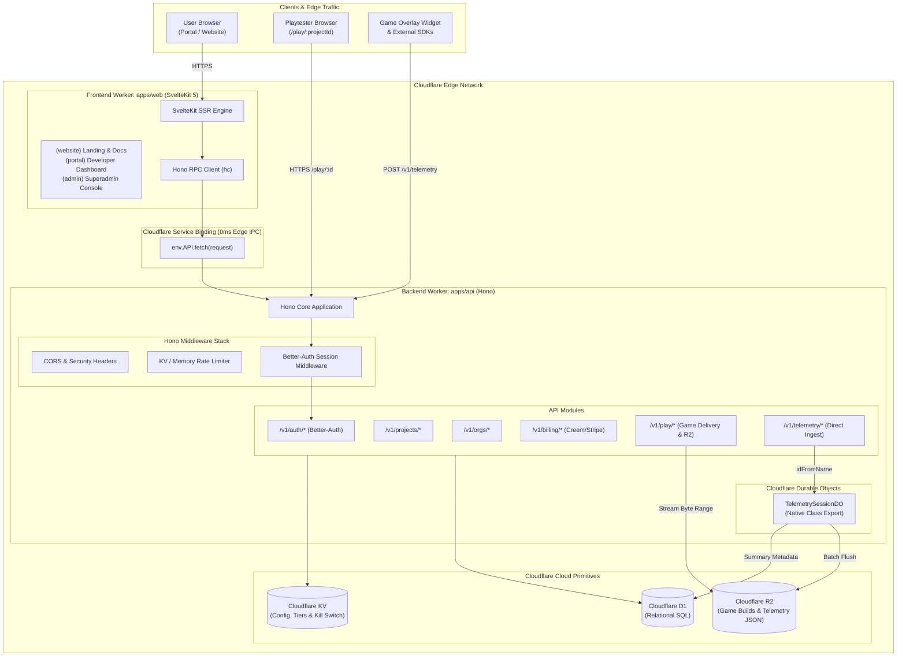
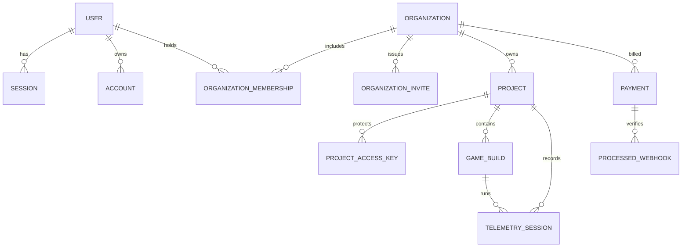
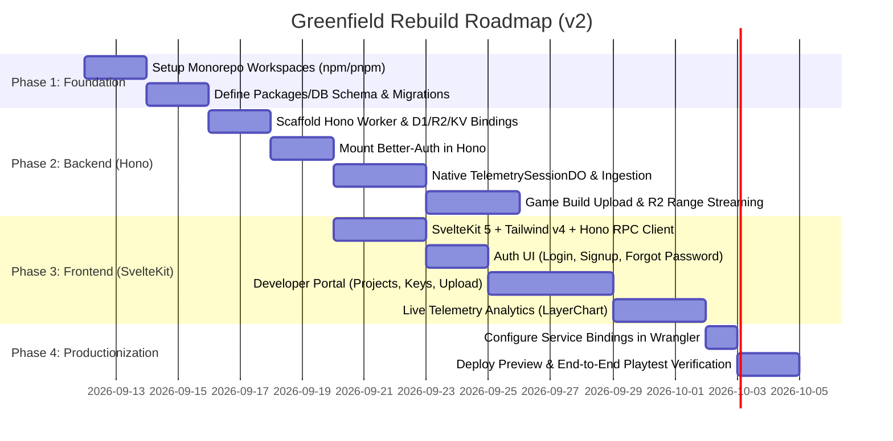

# ISITFUN — System Architecture & Greenfield Design Guide (v2)

> **Status**: Approved Architectural Blueprint  
> **Target Stack**: Cloudflare Workers + Hono (Backend & DO) + SvelteKit 5 (Frontend & SSR) + Drizzle ORM + D1 + R2 + KV + Better-Auth  
> **Repository Strategy**: Monorepo (`apps/api`, `apps/web`, `packages/db`, `packages/shared`)

---

## 1. Executive Summary & The "Why"

The initial v1 prototype proved the core value proposition:
* In-browser game playtesting with live instrumentation.
* In-memory session telemetry buffering via Cloudflare Durable Objects.
* Multi-tenant game asset storage via Cloudflare R2 and relational metadata in Cloudflare D1.

However, cramming high-frequency telemetry ingestion, binary game asset streaming, Durable Object lifecycle management, and SSR dashboard logic into a **single monolithic SvelteKit worker** introduced structural debt:
1. **Durable Object Export Hack**: SvelteKit's Cloudflare adapter does not natively export Durable Object classes, forcing a brittle post-build AST patch (`sveltekit-cloudflare-do`).
2. **Middleware Latency Drag**: Every 2-second telemetry beacon from running games ran through SvelteKit's full hook pipeline, executing database client instantiations and Better-Auth session checks on requests that only need anonymous ingestion.
3. **WeakMap Auth Cache Failure**: Re-instantiating Better-Auth and D1 client wrappers per-request broke in-memory caching mechanisms across edge invocations.
4. **Coupled Surface Area**: Game engines (Godot, Unity, Unreal) needing a lightweight HTTP/REST ingestion SDK were forced to interact with SvelteKit-opinionated routes.

Because the platform currently has **zero active production users**, we have the rare window to rebuild **from first principles** without backward compatibility baggage.

---

## 2. High-Level Architecture Topology

The v2 architecture decouples the system into two specialized Cloudflare Workers connected at the edge via **Cloudflare Service Bindings** (0ms latency, zero-cost, in-memory IPC):



### Key Architectural Wins of This Topology:
1. **Native DO Exports**: Hono directly exports `TelemetrySessionDO` from `index.ts`. No monkey-patching or AST rewriting tools needed.
2. **Zero-Overhead Ingestion**: Telemetry calls skip SSR, cookie checks, and user authentication entirely, routing directly to the DO in `< 5ms`.
3. **No CORS / Zero Network Overhead for SSR**: SvelteKit talks to Hono via Cloudflare Service Bindings (`platform.env.API.fetch(request)`). SvelteKit server loaders get raw typed data directly from Hono in-memory.
4. **Single-Source Type Safety**: Hono's RPC client (`hc<AppType>`) gives SvelteKit compile-time end-to-end type safety for every API route with zero code-generation.

---

## 3. Monorepo Workspace Structure

We will adopt an `npm` or `pnpm` workspaces layout:

```text
isitfun/
├── apps/
│   ├── api/                           # Backend Cloudflare Worker (Hono)
│   │   ├── src/
│   │   │   ├── durable-objects/
│   │   │   │   └── TelemetrySessionDO.ts  # Native DO Class
│   │   │   ├── middleware/
│   │   │   │   ├── auth.ts            # Better-Auth session extractor
│   │   │   │   ├── guard.ts           # RBAC & Org tier guards
│   │   │   │   └── rate-limit.ts      # Cloudflare KV rate limiting
│   │   │   ├── routes/
│   │   │   │   ├── identity/          # auth, profile
│   │   │   │   ├── games/             # projects, play, telemetry
│   │   │   │   ├── workspace/         # orgs, dashboard
│   │   │   │   ├── billing/           # billing, webhooks
│   │   │   │   └── admin/             # admin stats & governance
│   │   │   ├── lib/
│   │   │   │   ├── auth.ts            # Better-Auth Hono configuration
│   │   │   │   ├── crypto.ts          # Play session token signatures
│   │   │   │   └── r2.ts              # R2 range streaming helpers
│   │   │   ├── index.ts               # Worker entry point & DO exports
│   │   │   └── wrangler.jsonc         # D1, KV, R2 & DO bindings
│   │   ├── tsconfig.json
│   │   └── package.json
│   │
│   └── web/                           # Frontend Cloudflare Worker (SvelteKit)
│       ├── src/
│       │   ├── lib/
│       │   │   ├── api/
│       │   │   │   └── client.ts      # Typed Hono RPC client (hc)
│       │   │   ├── components/        # Svelte 5 UI components (runes)
│       │   │   │   ├── charts/        # LayerChart visualizers
│       │   │   │   ├── dashboard/     # Console inspector, session logs
│       │   │   │   └── ui/            # Buttons, modals, tabs, forms
│       │   │   └── state/             # Reactive client runes ($state)
│       │   ├── routes/
│       │   │   ├── (website)/         # Landing page, pricing, docs
│       │   │   ├── (auth)/            # Login, register, invite accept
│       │   │   └── (portal)/          # Dashboard, analytics, settings
│       │   ├── hooks.server.ts        # SSR session passing via Service Binding
│       │   └── app.d.ts
│       ├── wrangler.jsonc             # SvelteKit Worker with API Service Binding
│       ├── tsconfig.json
│       └── package.json
│
├── packages/
│   ├── db/                            # Shared Database Package
│   │   ├── migrations/                # D1 SQL migration files
│   │   ├── src/
│   │   │   ├── schema/
│   │   │   │   ├── auth.ts            # Better-Auth tables (user, session, etc.)
│   │   │   │   ├── orgs.ts            # Orgs, memberships, invites
│   │   │   │   ├── projects.ts        # Games, access keys, quotas
│   │   │   │   ├── builds.ts          # Game builds & asset manifests
│   │   │   │   ├── telemetry.ts       # Telemetry sessions & aggregates
│   │   │   │   └── payments.ts        # Subscriptions & webhook logs
│   │   │   ├── client.ts              # Drizzle D1 factory
│   │   │   └── index.ts               # Unified schema exports
│   │   ├── drizzle.config.ts
│   │   └── package.json
│   │
│   └── shared/                        # Shared Types & Contracts
│       ├── src/
│       │   ├── schemas/               # Valibot schemas (validation contracts)
│       │   ├── types/                 # Shared domain interfaces & DTOs
│       │   └── constants/             # Tier limits, error codes
│       └── package.json
│
├── package.json                       # Workspace root scripts
└── turbo.json / pnpm-workspace.yaml
```

---

## 4. Database Redesign (Clean, Normalized Schema)

### Design Flaws Fixed in v2:
* **Separation of Concerns**: Better-Auth tables isolated in `packages/db/src/schema/auth.ts`. Custom app metadata moved out of auth tables and normalized into clean relational entities.
* **Strict Multi-Tenancy**: Every project belongs to an `organization`. Users access projects strictly through `organization_memberships` with roles (`owner`, `admin`, `member`).
* **Session Metadata vs. Raw Logs**: D1 stores high-level metrics for fast indexing (FPS, duration, crash flag, sentiment). Raw granular logs live strictly in R2 as compressed JSON objects, preventing D1 row bloat.

### Unified Entity Relationship Diagram:



### Table Definitions (Drizzle D1):

```ts
// 1. Organization & Multi-Tenancy
export const organizations = sqliteTable('organizations', {
  id: text('id').primaryKey(),
  name: text('name').notNull(),
  slug: text('slug').notNull().unique(),
  tier: text('tier', { enum: ['free', 'pro_pass', 'team'] }).notNull().default('free'),
  stripeCustomerId: text('stripe_customer_id'),
  createdAt: integer('created_at', { mode: 'timestamp_ms' }).notNull(),
  updatedAt: integer('updated_at', { mode: 'timestamp_ms' }).notNull()
});

export const organizationMemberships = sqliteTable('organization_memberships', {
  id: text('id').primaryKey(),
  orgId: text('org_id').notNull().references(() => organizations.id, { onDelete: 'cascade' }),
  userId: text('user_id').notNull().references(() => user.id, { onDelete: 'cascade' }),
  role: text('role', { enum: ['owner', 'admin', 'member'] }).notNull().default('member'),
  createdAt: integer('created_at', { mode: 'timestamp_ms' }).notNull()
});

// 2. Projects & Access
export const projects = sqliteTable('projects', {
  id: text('id').primaryKey(),
  orgId: text('org_id').notNull().references(() => organizations.id, { onDelete: 'cascade' }),
  name: text('name').notNull(),
  slug: text('slug').notNull(),
  description: text('description'),
  activeBuildId: text('active_build_id'),
  isPublic: integer('is_public', { mode: 'boolean' }).notNull().default(false),
  createdAt: integer('created_at', { mode: 'timestamp_ms' }).notNull(),
  updatedAt: integer('updated_at', { mode: 'timestamp_ms' }).notNull()
});

export const projectAccessKeys = sqliteTable('project_access_keys', {
  id: text('id').primaryKey(),
  projectId: text('project_id').notNull().references(() => projects.id, { onDelete: 'cascade' }),
  label: text('label').notNull(),
  code: text('code').notNull().unique(),
  maxUses: integer('max_uses').notNull().default(20),
  usedCount: integer('used_count').notNull().default(0),
  isActive: integer('is_active', { mode: 'boolean' }).notNull().default(true),
  expiresAt: integer('expires_at', { mode: 'timestamp_ms' }),
  createdAt: integer('created_at', { mode: 'timestamp_ms' }).notNull()
});

// 3. Builds & Storage
export const gameBuilds = sqliteTable('game_builds', {
  id: text('id').primaryKey(),
  projectId: text('project_id').notNull().references(() => projects.id, { onDelete: 'cascade' }),
  version: text('version').notNull().default('1.0.0'),
  r2Prefix: text('r2_prefix').notNull(),
  entrypoint: text('entrypoint').notNull().default('index.html'),
  sizeBytes: integer('size_bytes').notNull().default(0),
  uploadedAt: integer('uploaded_at', { mode: 'timestamp_ms' }).notNull()
});

// 4. Telemetry Sessions (Index & Summary Table)
export const telemetrySessions = sqliteTable('telemetry_sessions', {
  id: text('id').primaryKey(),
  projectId: text('project_id').notNull().references(() => projects.id, { onDelete: 'cascade' }),
  buildId: text('build_id').references(() => gameBuilds.id, { onDelete: 'set null' }),
  deviceHash: text('device_hash').notNull(),
  browser: text('browser'),
  gpu: text('gpu'),
  durationSeconds: integer('duration_seconds').notNull().default(0),
  avgFps: integer('avg_fps'),
  minFps: integer('min_fps'),
  hasCrashed: integer('has_crashed', { mode: 'boolean' }).notNull().default(false),
  sentiment: text('sentiment', { enum: ['fun', 'neutral', 'unfun'] }),
  feedbackComment: text('feedback_comment'),
  r2LogPath: text('r2_log_path'), // Points to full JSON array in R2
  startedAt: integer('started_at', { mode: 'timestamp_ms' }).notNull(),
  endedAt: integer('ended_at', { mode: 'timestamp_ms' })
});
```

---

## 5. Backend Architecture (Hono on Cloudflare)

### A. Entry Point & Native Durable Object Export
In `apps/api/src/index.ts`:

```ts
import { Hono } from 'hono';
import { cors } from 'hono/cors';
import { authRouter } from './routes/identity';
import { projectsRouter, telemetryRouter, playRouter } from './routes/games';
import { TelemetrySessionDO } from './durable-objects/TelemetrySessionDO';

// 1. Export DO class directly (Clean native Cloudflare Workers pattern)
export { TelemetrySessionDO };

export type Env = {
  Bindings: {
    DB: D1Database;
    ISITFUN_KV: KVNamespace;
    GAMES_BUCKET: R2Bucket;
    TELEMETRY_BUFFER: DurableObjectNamespace;
    BETTER_AUTH_SECRET: string;
    BETTER_AUTH_URL: string;
  };
  Variables: {
    user: User | null;
    session: Session | null;
    db: DrizzleClient;
  };
};

const app = new Hono<Env>();

// 2. Ultra-lean global middleware
app.use('*', cors());

// 3. Mount modular route handlers
const routes = app
  .basePath('/v1')
  .route('/auth', authRouter)
  .route('/projects', projectsRouter)
  .route('/play', playRouter)
  .route('/telemetry', telemetryRouter);

export default app;
export type AppType = typeof routes; // Exported for SvelteKit Hono RPC Client!
```

### B. Durable Object Telemetry Buffering
The `TelemetrySessionDO` operates with zero build hacks:
* Receives batches of player events via HTTP `POST`.
* Maintains state in DO memory and transactional DO storage.
* On player exit or after 10 minutes of inactivity (via Cloudflare Alarms), writes the final raw log file to **R2** (`builds/{projectId}/sessions/{sessionId}.json`) and writes session summary metrics to **D1** (`telemetry_sessions`), then destroys its state.

---

## 6. Frontend Architecture (SvelteKit 5 + Hono RPC)

### A. End-to-End Type Safety via Hono RPC Client (`hc`)
In `apps/web/src/lib/api/client.ts`:

```ts
import { hc } from 'hono/client';
import type { AppType } from 'apps-api'; // Direct monorepo type import

export function createApiClient(fetchFn: typeof fetch, baseUrl: string) {
  return hc<AppType>(baseUrl, { fetch: fetchFn });
}
```

### B. Seamless SSR Data Fetching via Cloudflare Service Binding
In `apps/web/src/hooks.server.ts`:

```ts
import type { Handle } from '@sveltejs/kit';
import { createApiClient } from '$lib/api/client';

export const handle: Handle = async ({ event, resolve }) => {
  // Use Cloudflare Service Binding if in Worker environment, fallback to fetch in dev
  const serviceFetch = event.platform?.env?.API?.fetch?.bind(event.platform.env.API) ?? event.fetch;
  
  // Inject typed API client directly into event.locals
  event.locals.api = createApiClient(serviceFetch, 'https://api.internal/v1');

  // Forward user session cookie directly through Service Binding
  const authResponse = await event.locals.api.auth.session.$get({}, {
    headers: { cookie: event.request.headers.get('cookie') ?? '' }
  });

  if (authResponse.ok) {
    const sessionData = await authResponse.json();
    event.locals.user = sessionData.user;
    event.locals.session = sessionData.session;
  }

  return resolve(event);
};
```

In any SvelteKit `+page.server.ts`:
```ts
export const load = async ({ locals }) => {
  // 100% Type-safe call to Hono, running in-memory over Cloudflare Service Binding!
  const res = await locals.api.projects.$get();
  const projects = await res.json();
  return { projects };
};
```

---

## 7. Authentication Strategy (Better-Auth on Hono)

1. **Host Better-Auth inside `apps/api`**:
   Mount Better-Auth on Hono at `/v1/auth/*`. Better-Auth handles sign-up, sign-in, OAuth redirects, email verification, and session tokens.
2. **Shared Domain Cookies**:
   Deploy the web app to `isitfun.com` and the API to `api.isitfun.com` (or route `/v1/*` via Cloudflare Worker routes). Configure Better-Auth with:
   ```ts
   cookie: {
     domain: '.isitfun.com', // Allows both web and API to access session cookies natively
     sameSite: 'lax',
     secure: true
   }
   ```
3. **RBAC & Route Protection**:
   Hono middleware guards protected routes (`/v1/projects`, `/v1/orgs`). If a request lacks a valid session token, Hono returns `401 Unauthorized`.
4. **SvelteKit Server Guards**:
   SvelteKit checks `event.locals.user` in `src/routes/(portal)/+layout.server.ts` and issues immediate 302 redirects to `/login` if unauthenticated, preventing flash-of-unauthenticated-content.

---

## 8. Game Hosting & Streaming Engine (`/play/:projectId`)

* **Packaging**: Developers upload a game build as a `.zip` archive containing WebGL/WASM assets (`index.html`, `.wasm`, `.data`, `.js`).
* **Extraction to R2**: The backend extracts the files to `games/{projectId}/{buildId}/*`.
* **High-Performance Delivery**:
  * In Hono, `/v1/play/:projectId/*` reads chunks directly from R2 using `env.GAMES_BUCKET.get(key, { range })`.
  * **Headers**: Implements HTTP 206 Partial Content (Range requests) and sets mandatory security headers for modern game engines:
    ```http
    Cross-Origin-Opener-Policy: same-origin
    Cross-Origin-Embedder-Policy: require-corp
    ```
  * **Overlay Injection**: On requesting `index.html`, Hono injects the `<script src="/assets/widget.js">` tag before `</body>`, binding telemetry reporting to the player's session token.

---

## 9. Phased Greenfield Implementation Roadmap



### Phase 1: Workspace & Schema Standardization
1. Initialize monorepo root (`apps/api`, `apps/web`, `packages/db`, `packages/shared`).
2. Move Drizzle schema into `packages/db` with clean multi-tenant tables.
3. Run initial clean migration on Cloudflare D1.

### Phase 2: Hono Backend & Durable Objects
1. Scaffold `apps/api` with Hono + Wrangler.
2. Configure native `TelemetrySessionDO` export (eliminating `sveltekit-cloudflare-do`).
3. Implement `/v1/telemetry` ingestion and alarm flush logic.
4. Implement `/v1/play/*` R2 asset streaming with Range requests and COOP/COEP headers.
5. Configure Better-Auth with SQLite/D1 Drizzle adapter.

### Phase 3: SvelteKit 5 Frontend
1. Scaffold `apps/web` with SvelteKit 5 (runes).
2. Wire up Hono RPC client (`hc<AppType>`).
3. Connect Cloudflare Service Binding in `wrangler.jsonc`.
4. Rebuild Developer Portal (Project management, access keys, real-time analytics with LayerChart).

### Phase 4: Verification & Cutover
1. Validate end-to-end game upload, playtest launch, telemetry collection, and session export.
2. Run automated integration tests across both workers.
3. Deploy to live custom domain via Wrangler.

---

## 10. Summary Checklist: What Gets Removed vs. What Gets Gained

| Area | What Gets Deleted / Retired ❌ | What We Gain in v2 ✅ |
| :--- | :--- | :--- |
| **Durable Objects** | `sveltekit-cloudflare-do` build hack & AST patch script | Native `export { TelemetrySessionDO }` in Hono |
| **Telemetry Ingestion** | SvelteKit `hooks.server.ts` overhead (DB & auth run on every ping) | Raw `< 5ms` sub-request routing straight to the DO |
| **Database Models** | Conflicting `user` declarations, duplicated tables, unindexed joins | Normalized `packages/db` with strict multi-tenant org tenancy |
| **API Layer** | Ad-hoc `+server.ts` and experimental Remote Functions | Unified Hono REST API with OpenAPI & automatic `hc` client types |
| **Auth Session Sync** | Fragile `WeakMap` cache misses on every worker request | Unified Better-Auth server in Hono with shared domain cookies |
| **Worker Boundary** | Monolithic SvelteKit bundle mixing static SSR and high-throughput I/O | Fast frontend edge renderer + decoupled high-scale backend worker |
