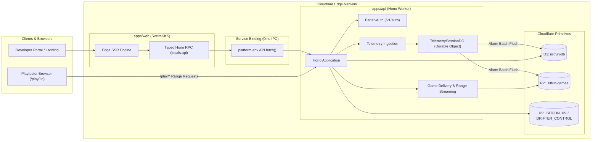

# ISITFUN — In-Browser Playtesting & Telemetry Platform (v2)

> High-performance Cloudflare Workers Monorepo for HTML5/WebGL game playtesting, live telemetry buffering, and developer analytics.

---

## 🏗️ Architecture Topology

`isitfun` is architected as two decoupled Cloudflare Workers connected at the edge via **Cloudflare Service Bindings** (0ms latency, zero-cost in-memory IPC):



### Key Architectural Wins:
1. **Zero-Storage Isolation**: `apps/web` has zero direct database (D1) or storage (R2/KV) bindings. It communicates purely via typed Hono RPC (`locals.api`) over Cloudflare Service Bindings.
2. **Native Durable Objects**: `TelemetrySessionDO` is exported directly as a native class from `apps/api/src/index.ts`, eliminating AST patch hacks.
3. **Sub-5ms Telemetry Ingestion**: High-frequency game telemetry bypasses SSR, cookie extraction, and user auth overhead, forwarding directly to in-memory Durable Object buffers.
4. **End-to-End Compile-Time Type Safety**: Hono's RPC client (`hc<AppType>`) grants `apps/web` compile-time type safety across all backend routes without code generation.

---

## 📁 Monorepo Workspace Map

```text
isitfun/
├── apps/
│   ├── api/                           # Backend Cloudflare Worker (Hono + Better-Auth + Native DO)
│   │   ├── src/
│   │   │   ├── durable-objects/       # TelemetrySessionDO in-memory session buffer
│   │   │   ├── middleware/            # Auth session extractor, RBAC guards
│   │   │   ├── routes/                # auth, dashboard, projects, orgs, telemetry, play, billing
│   │   │   └── index.ts               # Worker entrypoint & native DO export
│   │   └── wrangler.jsonc             # D1, R2, KV & DO Cloudflare bindings
│   │
│   └── web/                           # Frontend Cloudflare Worker (SvelteKit 5 + DaisyUI)
│       ├── src/
│       │   ├── lib/components/        # Svelte 5 runes UI components
│       │   ├── routes/                # (website), (auth), (portal)
│       │   └── hooks.server.ts        # Zero-latency Service Binding proxy & locals.api
│       └── wrangler.jsonc             # Pure Service Binding worker (API -> isitfun-api)
│
└── packages/
    ├── db/                            # Unified Drizzle ORM Schema & D1 Client Factory
    │   ├── migrations/                # D1 SQL migration files
    │   └── src/schema/                # Normalized auth, orgs, projects, telemetry tables
    │
    └── shared/                        # Shared Valibot Schemas, Types & Web Crypto
        └── src/                       # Telemetry schemas, Tier hard caps, HMAC signatures
```

---

## 🚀 Quickstart & Local Development

### 1. Prerequisites
- Node.js `22.x` or higher
- npm `10.x` or higher

### 2. Install Dependencies
```bash
npm install
```

### 3. Environment Configuration
Copy `.env.example` to set up local environment files:
- Backend worker secrets: `apps/api/.dev.vars` (see `.env.example`)
- Frontend client configs: `apps/web/.env`

### 4. Start Development Servers
Run both workers concurrently (`apps/api` on `8787` and `apps/web` on `5173`):
```bash
npm run dev
```
Or run individually:
```bash
npm run dev:api   # Hono API Worker (http://localhost:8787)
npm run dev:web   # SvelteKit Frontend (http://localhost:5173)
```

---

## 🗄️ Database Management (`packages/db`)

Migrations are managed with Drizzle Kit targeting Cloudflare D1:

```bash
# Generate new SQL migration from schema modifications
npm run db:generate

# Apply migrations to local Miniflare D1 SQLite database
npm run db:migrate

# Push schema directly to local dev database (prototyping)
npm run db:sync
```

---

## 🧪 Testing & Code Quality

```bash
# Static type checking across all 4 packages/apps (0 errors, 0 warnings)
npm run check

# Run unit and integration tests (Vitest)
npm test

# Run multi-worker end-to-end tests (Playwright)
npm run test:e2e --workspace=@isitfun/web

# Code style formatting & linting
npm run lint
npm run format
```

---

## 🚢 Production Deployment (Cloudflare Git Integration)

Deployments are natively automated via **Cloudflare Workers Git Integration (Push-to-Deploy)** connected to your GitHub repository:

### Cloudflare Dashboard Configuration
1. **API Worker (`isitfun-api`)**:
   - Repository: `cntrvsy/isitfun` (branch: `main`)
   - Root directory: `apps/api` (or monorepo root)
   - Build command: `npm run build:api`
   - Deploy command: `wrangler deploy`

2. **Web Worker (`isitfun`)**:
   - Repository: `cntrvsy/isitfun` (branch: `main`)
   - Root directory: `apps/web` (or monorepo root)
   - Build command: `npm run build:web`
   - Deploy command: `wrangler deploy`
   - Service Binding: `API` -> `isitfun-api` (already configured in `wrangler.jsonc`)

Whenever you push commits to `main`, Cloudflare automatically builds and deploys both workers across the global edge network.
